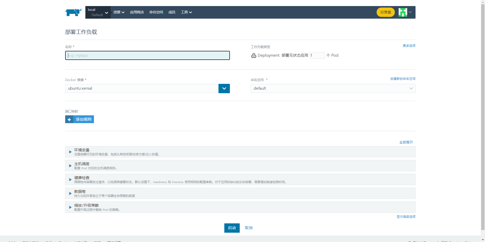
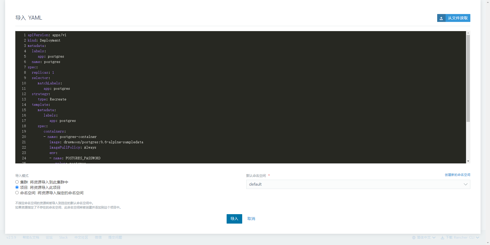
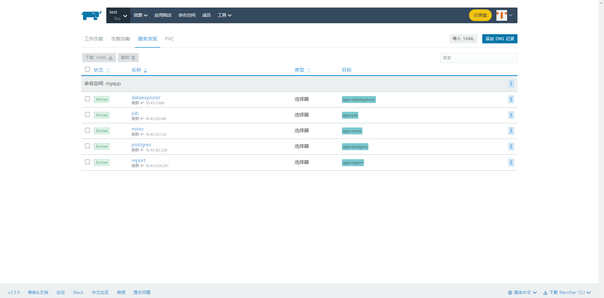
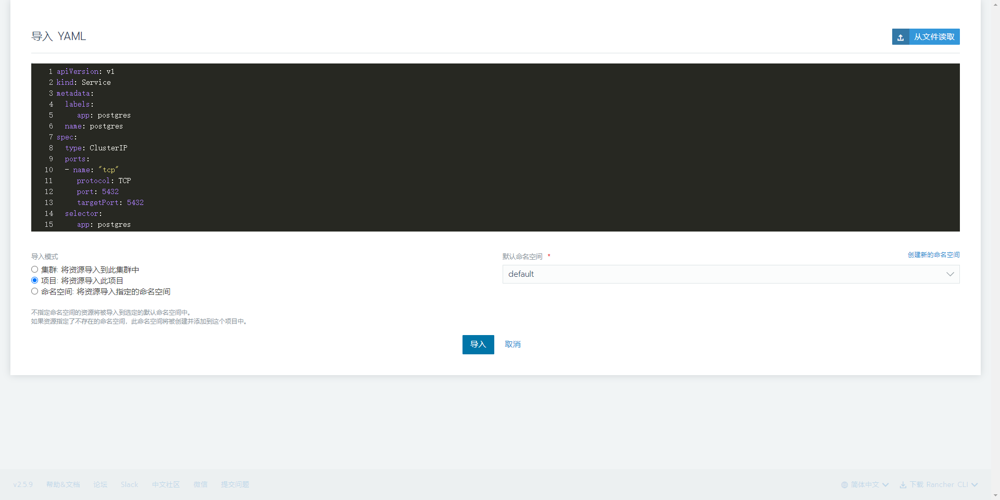
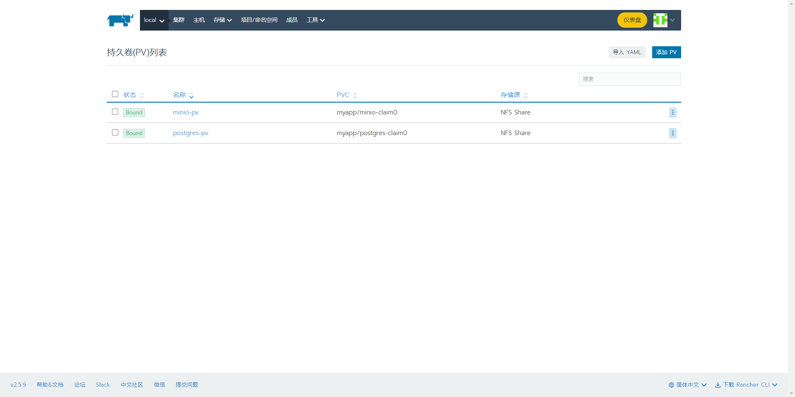
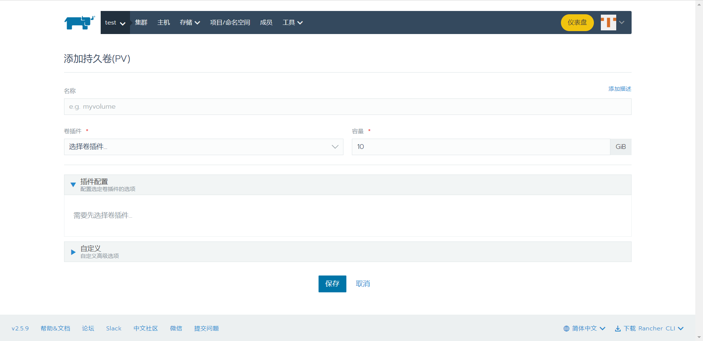
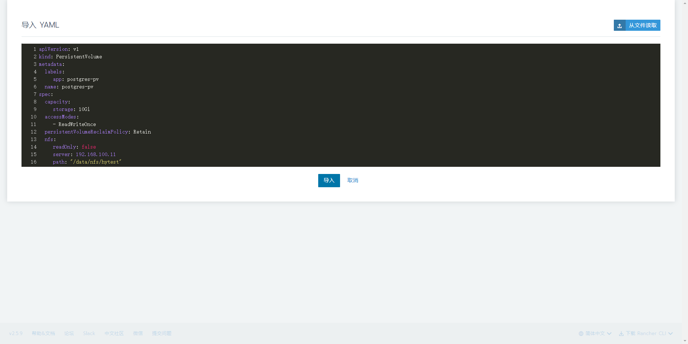
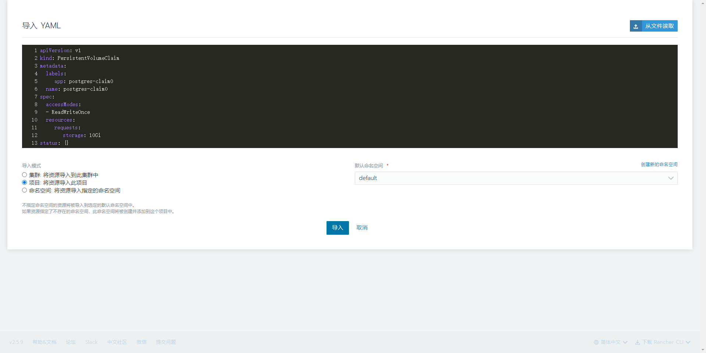

# 企业级容器管理平台 Rancher

- [安装 Rancher Server](#安装-rancher-server)
- [部署工作负载](#部署工作负载)
- [部署服务](#部署服务)
- [添加持久化卷](#添加持久化卷)
- [添加持久卷声明](#添加持久卷声明)
- [配置私有镜像注册中心](#配置私有镜像注册中心)

## 安装 Rancher Server

```bash
docker run -d --privileged --restart=unless-stopped -p 80:80 -p 443:443 rancher/rancher:latest
```

Rancher UI 的默认端口是 `443`，访问 `https://localhost` 打开 Rancher UI。


## 部署工作负载

选择项目，选择工作负载，可以看到当前项目下的工作负载。


点击部署，填写配置后再点击 `部署` 后，会立即启动 `Pod`，显示 `Active` 的 `Pod` 就已经运行成功了。



### 导入 YAML 文件部署工作负载

点击 `导入 YAML`，然后选择 `从文件中读取`，选择 `yaml` 文件，选择 `命名空间`，最后点击 `导入`。



## 部署服务

选择项目，选择服务发现，可以看到项目下部署的服务。



点击 **添加 DNS 记录**，进入到添加界面。


### 导入 YAML 文件部署服务

点击 `导入 YAML`，然后选择 `从文件中读取`，选择 `yaml` 文件，选择 `命名空间`，最后点击 `导入`。



## 添加持久化卷

选择集群，选择存储 -> 持久卷，可以看到集群下的持久卷。



点击 `添加 PV`。



### 导入 YAML 文件添加持久化卷

点击 `导入 YAML`，然后选择 `从文件中读取`，选择 `yaml` 文件，选择 `命名空间`，最后点击 `导入`。



## 添加持久卷声明

选择项目，选择 PVC，可以看到项目下的持久卷声明。


### 导入 YAML 文件添加持久卷声明

点击 `导入 YAML`，然后选择 `从文件中读取`，选择 `yaml` 文件，选择 `命名空间`，最后点击 `导入`。



## 配置私有镜像注册中心

在 Rancher 容器中 `/etc/rancher/k3s/` 目录下创建 `registries.yaml` 文件，例如：

```bash
mirrors:
  "192.168.10.229":
    endpoint:
      - "http://192.168.10.229"
```

### 有账号密码认证的私有镜像注册中心

```bash
mirrors:
  "192.168.10.229":
    endpoint:
      - "http://192.168.10.229"
configs:
  "192.168.10.229":
  auth:
    username: admin
    password: 123456
```

### 使用 TLS

```bash
mirrors:
  "192.168.10.229":
    endpoint:
      - "https://192.168.10.229"
configs:
  "192.168.10.229":
  auth:
    username: admin
    password: 123456
  tls:
    cert_file: /cert_file
    key_file: /key_file
    ca_file: /ca_file
```